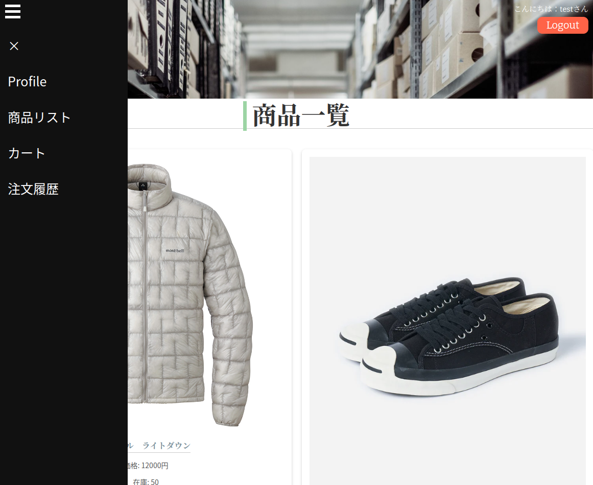

# 在庫管理システム
内部で簡易的に使用する在庫管理システム

## 概要
- **ユーザ機能**:
  - 商品購入
  - プロフィール
- **管理者機能**:
  - 商品管理
  - 人材管理
  - 売上管理
  - インポートコネクタ(Snowflake)
  - AuditLog（ログインのみ）




## Local環境のDocker

1. このリポジトリをクローンします。
    ```bash
    git clone https://github.com/ksm1132/ims.git
    ```
2. 環境変数の設定 

application.propertiesの確認と修正

3. applicationのビルド
    ```bash
    mvn clean package -DTest
    ```

4. docker composeによる起動
    ```bash
    docker compose up --build
    ```

## AWS FARGATE

1. AWS環境の構築

最低限ECR、ECSがあれば実行可能

2. maven.ymlファイル修正

### 以下注意
- 環境変数
- Triger条件
- Push先
